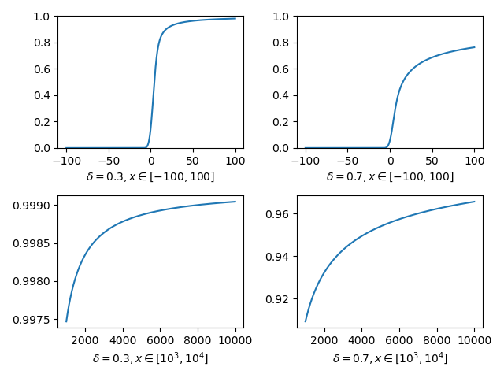

# Problem 1
The objective of this problem is to approximate the CDF of $X$ based on the survival function below.First we solve for $F(x)$ as below,

\begin{align}
F(x) &= 1 - \int_{x-1}^\infty \phi_{\tau}(\epsilon)d\epsilon - \int_{-\infty}^{x-1}\{ \frac{\delta}{2\delta - 1}(x - \epsilon)^{-\frac{1-\delta}{\delta}} - \frac{1 - \delta}{2\delta - 1} (x - \epsilon)^{-1} \}\phi_{\tau}(\epsilon)d\epsilon \\
&= \int_{-\infty}^{x-1} \{1 - \frac{\delta}{2\delta - 1}(x - \epsilon)^{-\frac{1-\delta}{\delta}} + \frac{1 - \delta}{2\delta - 1} (x - \epsilon)^{-1} \}\phi_{\tau}(\epsilon)d\epsilon
\end{align}

We started the problem with defining the integrand as in the above equation in python and intergrating it in python as well. But this failed as we saw jumps in the CDF. Hence we transformed the integral such that the integral is in the finite interval $(0,1]$.

Let $x-\epsilon = \frac{1}{t}$ so that $(-\infty,x-1]$ maps to $(0,1]$. Then the CDF $F(x)$ can be written as below,

\begin{align}
F(x) &= \int_{0}^{1} \Bigg\{1 - \frac{\delta}{2\delta - 1}\Bigg(\frac{1}{t}\Bigg)^{-\frac{1-\delta}{\delta}} + \frac{1 - \delta}{2\delta - 1} \Bigg(\frac{1}{t}\Bigg)^{-1} \Bigg\}\frac{\phi_{\tau}(x-1/t)}{t^2}dt
\end{align}

Then we proceeded to use the three different ways to intergate this function in python and C++ using gsl. Complete code is submitted with the homework. The below figure shows the estimate of the CDF for the two different values of $\delta$ and for different ranges of $X$.

{width="70%"}

## Define integrand in Python
Based on the previous calculation, we define the following integrand in python.

```{python eval=FALSE, python.reticulate = FALSE}
def normal_density(eps, tau):
    return np.exp(-eps*eps/(2*tau*tau))/(tau*np.sqrt(2*np.pi))

def integrand(eps, x, delta, tau):
    return (1 - (delta / (2*delta - 1)) * (x - eps)**(-(1 - delta) / delta) +
            ((1 - delta) / (2*delta - 1)) * (x - eps)**-1) * \
            normal_density(eps, tau)
```

Solving this integration with default parameters in `si.quad` will results in numerical issues at the tails of distribution. To deal with this, we tuning the `points` parameter to include the high density region. We can roughly observe that this integrate has high density within `(-10, 100)`.

```{python eval=FALSE, python.reticulate = FALSE}
def F(x, delta, tau, epsabs=1.49e-7, epsrel=1.49e-8):
    integral = si.quad(integrand, a=-1e6, b=x-1,
                       args=(x, delta, tau),
                       epsabs=epsabs, epsrel=epsrel,
                       points=[-10, 100])
    return integral[0]
F_vec = np.vectorize(F)
```

The computation time is 0.66s.
```{python eval=FALSE, python.reticulate = FALSE}
start = time.time()
X_vals1 = np.linspace(-100, 100, num=2000)
result = F_vec(X_vals1, 0.3, np.sqrt(10))
end = time.time()
print('running time:', end - start)
```

## Define integrate in C++

Below we define a similar integrand in C++
```{Rcpp eval=FALSE}
extern "C"
{
  double integrand(int n, double *params){
    double eps = params[0];
    double x   = params[1];
    double delta = params[2];
    double tau = params[3];
    double res =
      (1 - (delta / (2*delta - 1)) *
       pow((x - eps), (-(1 - delta) / delta)) +
       ((1 - delta) / (2*delta - 1)) * pow((x - eps), -1)) *
      exp(-eps*eps/(2*tau*tau))/(tau*sqrt(2*M_PI));
    return res;
  }
}
```

After compiling this integrand as `q1_integrand_cpp.so`, we then using the following script to load it into Python.

```{python eval=FALSE, python.reticulate = FALSE}
# load c++ integrand without gsl
lib = ctypes.CDLL(os.path.abspath('./hw2/q1_integrand_cpp.so'))
lib.integrand.restype = ctypes.c_double
lib.integrand.argtypes = (ctypes.c_int, ctypes.POINTER(ctypes.c_double))
integrand_cpp = LowLevelCallable(lib.integrand)
```

When called with `si.quad` with the same parameters, we observer that the running time reduces significantly to 0.04.

## Integrate in C++

Similar as `si.quad`, `gsl_integration_qagp` allows specifying the high density region through `pts` parameters. Unlike python, `pts` includes the integral bounds. We specify `pts` to be an array of length 4, and set `pts[0]` and `pts[3]` to two bounds. We then set `pts[1]` and `pts[2]` to lies in the intersection between `(-10, 100)` and `(pts[0], pts[3])`.
```{Rcpp eval=FALSE}
extern "C" {

  struct my_f_params {
    double x;
    double delta;
    double tau;
  };

  double integrand(double eps, void * p) {
    struct my_f_params *params = (struct my_f_params *)p;
    double x = (params->x);
    double delta = (params->delta);
    double tau = (params->tau);

    double res =
      (1 - (delta / (2 * delta - 1)) * pow((x - eps), (-(1 - delta) / delta)) +
       ((1 - delta) / (2 * delta - 1)) * pow((x - eps), -1)) *
      exp(-eps * eps / (2 * tau * tau)) / (tau * sqrt(2 * M_PI));
    return res;
  }

  double f_gsl(double x, double delta, double tau) {
    double result = 0.0;
    double error = 0.0;

    gsl_integration_workspace *w = gsl_integration_workspace_alloc(1e4);
    gsl_set_error_handler_off();
    struct my_f_params params = {x, delta, tau};
    int err = 0;

    gsl_function F;
    F.function = &integrand;
    F.params = &params;

    double sig_pts[2];
    if (x-1 <= -100) {
      sig_pts[0] = x - 3;
      sig_pts[1] = x - 2;
    } else if (x-1 <= 100) {
      sig_pts[0] = -100;
      sig_pts[1] = x - 2;
    } else {
      sig_pts[0] = -10;
      sig_pts[1] = 100;
    }
    double pts[4] = {-1000000.0, sig_pts[0], sig_pts[1], x-1.0};

    err = gsl_integration_qagp(&F, pts, 4,
                               1.49e-8, 1.49e-9, 50,
                               w, &result,&error);
    // Error handling: decrease epsabs if diverging
    if (err == GSL_EDIVERGE) {
      printf("Quadrature didn't converge.\n");
      exit(EXIT_FAILURE);
    }

    gsl_integration_workspace_free(w);
    return result;
  }
}
```

We then use the following script to load the C++ methods into Python.

```{python eval=FALSE, python.reticulate = FALSE}
lib_1 = ctypes.CDLL(os.path.abspath('./hw2/q1_integrand_cpp_gsl.so'))
lib_1.integrand.restype = ctypes.c_double
lib_1.integrand.argtypes = (ctypes.c_int, ctypes.c_void_p)
lib_1.f_gsl.restype = ctypes.c_double
lib_1.f_gsl.argtypes = (ctypes.c_double, ctypes.c_double, ctypes.c_double)
F_vec = np.vectorize(lib_1.f_gsl)
```

The running time is further reduced to 0.02 with the new `F_vec`.

# Problem 2

The objective of this problem is to obtain a sample from the exponentially tilted positive stable distribution which has the following pdf.

\begin{align*}
f(x; \theta)
&= \sqrt{\frac{1}{4\pi}} \frac{\text{exp}(-\frac{1}{4x} - \theta x)}{x^{3/2} \text{exp}(-\sqrt{\theta})} = \frac{\text{exp}(-\frac{1}{4x} - \theta x +\sqrt{\theta})}{\sqrt{4\pi} x^{3/2}}
\end{align*}

To sample from this distribution we use an exponential distribution with rate 0.09 as our proposal dtsribution which has the pdf $q(x)$ as below.
$$
q(x) = 0.09 e^{-0.09x}
$$

Then we use a rejection sampling technique to obtain the 100000 sample. The first step in the rejection sampling was to determine  $k$, the rejection factor. This was set by obtaining the maximum of the ratio of $f(x)/q(x)$ from a random sample. Based on our proposal distribution we set $k$ as 15.

We were able to replicate figure 3 based on our rejection sampling technique. 
```{r message=FALSE, warning=FALSE}
true_density <- function(x, theta = 0.1) {
  exp(-1/(4*x) - theta*x + sqrt(theta)) / (sqrt(4*pi) * x^(3/2))
}

proposal_density <- function(x) {
  0.09 * exp(-0.09 * x)
}

proposal_quantile <- function(x) {
  -log(1 - x) / 0.09
}

rejection_sampler <- function(N, K, true_dens, prop_dens, prop_quan) {
  res <- matrix(NA, 2, N)
  for (i in 1:N) {
    # Generate variable from proposal distribution
    U <- runif(1)
    exp_var <- prop_quan(U)
    counter <- 1
    # Evaluate ratio
    ratio <- true_dens(exp_var) / (K * prop_dens(exp_var))
    while (runif(1) > ratio) {
      # Generate variable from proposal distribution
      U <- runif(1)
      exp_var <- prop_quan(U)
      counter <- counter + 1
      # Update ratio
      ratio <- true_dens(exp_var) / (K * prop_dens(exp_var))
    }
    res[1, i] <- exp_var
    res[2, i] <- counter
  }
  return(res)
}

## Compute rejection factor K
N <- 100000
x_vec <- seq(1e-5, 60, length.out = N)
true_dens <- true_density(x_vec)
prop_dens <- proposal_density(x_vec)
print(sprintf("sup f(x)/q(x) is approximate to %.3f", max(true_dens / prop_dens)))
K <- 15
## sample
set.seed(5)
res <- rejection_sampler(N, K = K,
  true_dens = true_density,
  prop_dens = proposal_density,
  prop_quan = proposal_quantile)
samples <- res[1, ]
## plot
hist(samples, breaks = 1000, freq = FALSE, border = "lightblue")
curve(true_density, from = 1e-5, to = 60,
  n = 1000, add = TRUE, col = "red", lty = 3)
```

# Problem 3
The objective of this problem is to estimate the probability the diagonal of a matrix $X$ is all 1’s. The probability distribution of the matrix is as follows,

$$\pi(X) \propto  p^{N(X)}(1 - p)^{16 - N(X)} \text{exp}\{-\lambda D(X)\}.$$

where $N(X)$ is the total number of successes in $X$  and $D(X)$ is the sum of the absolute values of $MV$. $V$ is the flattened vector of $X$ and $M$ is given by:

$$
\left( \begin{array}{ccccccccccc}
1 & -1 & 0 & 0 & 0 & \cdots & 0 & 0 & 0 & 0 & 0 \\
\vdots & \vdots & \vdots & \vdots & \vdots & \ddots & \vdots & \vdots & \vdots & \vdots & \vdots \\
0 & 0 & 0 & 0 & 0 & \cdots & 0 & 0 & 0 & 1 & -1 \\
1 & 0 & 0 & 0 & -1 & \cdots & 0 & 0 & 0 & 0 & 0 \\
\vdots & \vdots & \vdots & \vdots & \vdots & \ddots & \vdots & \vdots & \vdots & \vdots & \vdots \\
0 & 0 & 0 & 0 & 0 & \cdots & 1 & 0 & 0 & 0 & -1
\end{array} \right)
$$

### (1) Algorithm Description

We built our MCMC with Metropolis updates since both $Q_1$ and $Q_2$ proposal algorithms are symmetric.
* - initial values - We generated a random $X$ matrix using independent Bernoulli random variables. 
* - $Q_1$ proposal algorithm - Used 16 iid Bernoulli random variables with 0.5 probability of success i.e.rbinom(16,1,0.5) to create $X$.
* - $Q_2$ proposal algorithm - First a location index of the matrix was selected by using sample(16, 1, replace = TRUE, prob = rep(0.0625, 16)). Then rbinom(1,1,0.5) was used to set the entry of the selected location to 1 or 0.
* - acceptance probability - $\alpha = min\{1,\pi(X^*)/\pi(X)\}$
* - Parameters - $N(X)$ and $D(X)$ parameters behavior was observed to understand model performance. 
* - Number of iterations - 200,000 iterations gave required results.

### (2) Algorithm Comparison 

The figure shows the acceptance rate over time. From the top row of the figure we can see that the acceptance rate is very low for the proposal algorithm $Q_1$ whereas $Q_2$ has a good acceptance rate over time. Hence we believe that $Q_2$ results in a faster mixing MCMC.

```{r message=FALSE, warning=FALSE}
library(batchmeans)

X <- matrix(c(1,0,0,0,
              1,1,0,0,
              0,0,0,0,
              0,0,0,0), ncol = 4, nrow = 4)


M1_base <- cbind(diag(3), rep(0, 3)) + cbind(rep(0, 3), -diag(3))
M1 <- rbind(
  cbind(M1_base, matrix(0, 3, 12)),
  cbind(matrix(0, 3, 4), M1_base, matrix(0, 3, 8)),
  cbind(matrix(0, 3, 8), M1_base, matrix(0, 3, 4)),
  cbind(matrix(0, 3, 12), M1_base))
M2_base <- cbind(diag(4), -diag(4))
M2 <- rbind(
  cbind(M2_base, matrix(0, 4, 8)),
  cbind(matrix(0, 4, 4), M2_base, matrix(0, 4, 4)),
  cbind(matrix(0, 4, 8), M2_base))
M <- rbind(M1, M2)


#test D
X <- matrix(c(1,0,0,0,
              0,0,0,0,
              0,0,0,0,
              0,0,0,0), ncol = 4, nrow = 4)
sum(abs(M%*%as.vector(X)))
X <- matrix(c(1,0,0,0,
              1,1,0,0,
              0,0,0,0,
              0,0,0,0), ncol = 4, nrow = 4)
sum(abs(M%*%as.vector(X)))

#density of X
prob_dist <- function(lambda, X){
  N_X <- sum(X)
  D_X <- sum(abs(M%*%as.vector(X)))
  prob <- 0.8^N_X * 0.2^(16-N_X) * exp(-lambda*D_X)
  return(prob)
}

log_prob_dist <- function(lambda, X){
  N_X <- sum(X)
  D_X <- sum(abs(M%*%as.vector(X)))
  prob <- N_X * log(0.8)  + (16-N_X)*log(0.2) - lambda*D_X
  return(prob)
}


Q1 <- function(X){
  X_star <- matrix(rbinom(16,1,0.5), nrow = 4, ncol = 4)
  return(X_star)
}

Q2 <- function(X){
  loc <- sample(16, 1, replace = TRUE, prob = rep(0.0625, 16))
  X[loc] <- rbinom(1,1,0.5)
  return(X)
}

#MCMC
MCMC <- function(X, N, Q, lambda){
  jump_trace <- array(0,N)
  N_X <- array(NA,N)
  D_X <- array(NA,N)
  #X_mat_array <- array(NA, dim = c(N,4,4))
  for (i in 1:N) {
    X_new <- Q(X)
    ratio <- prob_dist(lambda, X_new)/prob_dist(lambda, X)
    alpha <- min(1,ratio)
    if(runif(1) < alpha){
      X <- X_new
      jump_trace[i] <- 1
    }
    #if((i%%10000) == 0)
    #  print(paste0("Done with ",i))
    #X_mat_array[i,,] <- X 
    N_X[i] <- sum(X)
    D_X[i] <- sum(abs(M%*%as.vector(X)))
  }
  return(list(N_X = N_X, D_X = D_X, jump_trace = jump_trace))
}

X_init <- matrix(rbinom(16,1,0.5), nrow = 4, ncol = 4)
lambda <- c(0.5,1)
N <- 200000
q1_lambda1 <- MCMC(X_init, N, Q1, lambda[1])
q1_lambda2 <- MCMC(X_init, N, Q1, lambda[2])
q2_lambda1 <- MCMC(X_init, N, Q2, lambda[1])
q2_lambda2 <- MCMC(X_init, N, Q2, lambda[2])


par(mfrow = c(2,2))
cumulative_sums <- cumsum(q1_lambda1$jump_trace)
acc_prob <- cumulative_sums/1:N
plot(10000:N, acc_prob[10000:N], type = "l", 
     main = bquote(paste("Q1 and ",lambda == .(lambda[1]))), 
     ylab = "Acceptance Rate", xlab = "Iterations after 10000 burn-in")

cumulative_sums <- cumsum(q1_lambda2$jump_trace)
acc_prob <- cumulative_sums/1:N
plot(10000:N, acc_prob[10000:N], type = "l", 
     main = bquote(paste("Q1 and ",lambda == .(lambda[2]))), 
     ylab = "Acceptance Rate", xlab = "Iterations after 10000 burn-in")

cumulative_sums <- cumsum(q2_lambda1$jump_trace)
acc_prob <- cumulative_sums/1:N
plot(10000:N, acc_prob[10000:N], type = "l", 
     main = bquote(paste("Q2 and ",lambda == .(lambda[1]))), 
     ylab = "Acceptance Rate", xlab = "Iterations after 10000 burn-in")

cumulative_sums <- cumsum(q2_lambda2$jump_trace)
acc_prob <- cumulative_sums/1:N
plot(10000:N, acc_prob[10000:N], type = "l", 
     main = bquote(paste("Q2 and ",lambda == .(lambda[1]))), 
     ylab = "Acceptance Rate", xlab = "Iterations after 10000 burn-in")

mean(q2_lambda1$jump_trace)

## ESS
acf_q1_l1 <- acf(q1_lambda1$N_X, plot = FALSE)
ESS_q1_l1 <- N/(1+sum(acf_q1_l1$acf))
acf_q1_l2 <- acf(q1_lambda2$N_X, plot = FALSE)
ESS_q1_l2 <- N/(1+sum(acf_q1_l2$acf))

acf_q2_l1 <- acf(q2_lambda1$N_X, plot = FALSE)
ESS_q2_l1<- N/(1+sum(acf_q2_l1$acf))
acf_q2_l2 <- acf(q2_lambda2$N_X, plot = FALSE)
ESS_q2_l2 <- N/(1+sum(acf_q2_l2$acf))

```

Effective Sample Size(ESS) for the two parameters are given in the table below. ESS was computed as ,

$\hat{ESS} = \frac{N}{1+\sum_t\rho_t}$ where $\rho_t$ is the autocorrelation at lag $t$ for a given parameter.

* - ESS for $Q_1$ was 'ESS_q1_l1' and 'ESS_q1_l2' for $\lambda$ 0.5 and 1 respectively
* - ESS for $Q_2$ was 'ESS_q2_l1' and 'ESS_q2_l2' for $\lambda$ 0.5 and 1 respectively

### (3) 

```{r}
par(mfrow = c(2,2))
plot(1:N, q1_lambda1$N_X, type = "l", xlab = "iteration", ylab = "N(X)", main = bquote(paste("Q1 and ",lambda == .(lambda[1]))))
plot(1:N, q1_lambda2$N_X, type = "l", xlab = "iteration", ylab = "N(X)", main = bquote(paste("Q1 and ",lambda == .(lambda[2]))))
plot(1:N, q2_lambda1$N_X, type = "l", xlab = "iteration", ylab = "N(X)", main = bquote(paste("Q2 and ",lambda == .(lambda[1]))))
plot(1:N, q2_lambda2$N_X, type = "l", xlab = "iteration", ylab = "N(X)", main = bquote(paste("Q2 and ",lambda == .(lambda[2]))))

par(mfrow = c(2,2))
plot(1:N, q1_lambda1$D_X, type = "l", xlab = "iteration", ylab = "D(X)", main = bquote(paste("Q1 and ",lambda == .(lambda[1]))))
plot(1:N, q1_lambda2$D_X, type = "l", xlab = "iteration", ylab = "D(X)", main = bquote(paste("Q1 and ",lambda == .(lambda[2]))))
plot(1:N, q2_lambda1$D_X, type = "l", xlab = "iteration", ylab = "D(X)", main = bquote(paste("Q2 and ",lambda == .(lambda[1]))))
plot(1:N, q2_lambda2$D_X, type = "l", xlab = "iteration", ylab = "D(X)", main = bquote(paste("Q2 and ",lambda == .(lambda[2]))))

par(mfrow = c(2,4))
acf(q1_lambda1$N_X, main = bquote(paste("N(X) : Q1 and ",lambda == .(lambda[1]))))
acf(q1_lambda2$N_X, main = bquote(paste("N(X) : Q1 and ",lambda == .(lambda[2]))))
acf(q2_lambda1$N_X, main = bquote(paste("N(X) : Q2 and ",lambda == .(lambda[1]))))
acf(q2_lambda2$N_X, main = bquote(paste("N(X) : Q2 and ",lambda == .(lambda[2]))))
acf(q1_lambda1$D_X, main = bquote(paste("D(X) : Q1 and ",lambda == .(lambda[1]))))
acf(q1_lambda2$D_X, main = bquote(paste("D(X) : Q1 and ",lambda == .(lambda[2]))))
acf(q2_lambda1$D_X, main = bquote(paste("D(X) : Q2 and ",lambda == .(lambda[1]))))
acf(q2_lambda2$D_X, main = bquote(paste("D(X) : Q2 and ",lambda == .(lambda[2]))))

```

### (4) Estimate and Standard Errors
```{r}
batchmeans::bm(q1_lambda1$N_X)
batchmeans::bm(q1_lambda2$N_X)
batchmeans::bm(q2_lambda1$N_X)
batchmeans::bm(q2_lambda2$N_X)
```


# Problem 4

```{r echo=FALSE}
## Build the sampler function
# Define the model and priors
likelihood <- function(beta1, beta2, beta3, sigma2, X, Y) {
  y_pred <- (1 + beta1 * X)/(1 + beta2 * exp(beta3 * X))
  return(dnorm(Y, mean = y_pred, sd = sqrt(sigma2), log = TRUE))
}

prior_beta <- function(beta, tau2 = 10) {
  dnorm(beta, mean = 0, sd = sqrt(tau2), log = TRUE) # Non-informative prior
}

prior_sigma2 <- function(sigma2, a, b) {
  dgamma(sigma2, shape = a, scale = b, log = TRUE)
}


## Using gibbs sampler for Beta 1 and Matropolis-Hastings for rest of the parameters
## Treat the Beta 2 and Beta 3 as the block
mix_sampler <- function(X, Y, nburn, nsim, nthin, tau2 = 10, a = 1, b = 10) {
  m <- nrow(X)
  p <- ncol(X)
  inv.sigma.beta <- 1/tau2

  # Initial values
  Beta_1 <- 10
  Beta_2 <- 1
  Beta_3 <- 1 
  sigma2 <- 1

  # Chain containers
  Beta_1.chain <- array(0, dim = c(1, nsim / nthin))
  Beta_2.chain <- array(0, dim = c(1, nsim / nthin))
  Beta_3.chain <- array(0, dim = c(1, nsim / nthin))
  sigma2.chain <- rep(0, nsim / nthin)
  acceptance_beta.chain <- rep(0, nsim / nthin)
  acceptance_sigma.chain <- rep(0, nsim / nthin)

  for (index in 1:(nsim + nburn)) {
    if (index %% 10000 == 0) cat(index, "\n")
    # Define new parameters
    eta <- 1/(1 + Beta_2 * exp(Beta_3 * X))
    zeta <- X * eta

    # Update Beta 1
    var.Beta_1 <- solve(t(zeta) %*% zeta / sigma2 + inv.sigma.beta)
    mean.Beta_1 <- var.Beta_1 %*% (t(zeta) %*% (Y - eta) / sigma2)
    Beta_1 <- rnorm(1, mean.Beta_1, sqrt(var.Beta_1))
    
    # Update Beta 2 and Beta 3

    # Propose new values
    proposed_beta_2 <- rnorm(1, mean = Beta_2, sd = 0.05)
    proposed_beta_3 <- rnorm(1, mean = Beta_3, sd = 0.05)
    
    # Compute acceptance ratio
    log_acceptance_ratio_beta <- sum(likelihood(Beta_1, proposed_beta_2, proposed_beta_3, sigma2, X, Y)) +
      prior_beta(proposed_beta_2) + prior_beta(proposed_beta_3) -
      sum(likelihood(Beta_1, Beta_2, Beta_3, sigma2, X, Y)) -
      prior_beta(Beta_2) - prior_beta(Beta_3)

    # Accept or reject for Beta 2 and Beta 3
    if(log(runif(1)) < log_acceptance_ratio_beta) {
      Beta_2 <- proposed_beta_2
      Beta_3 <- proposed_beta_3
      acceptance_beta <- 1
    } else {
      Beta_2 <- Beta_2
      Beta_3 <- Beta_3
      acceptance_beta <- 0
    }
    
    # Update Sigma2
    # Propose sigma2
    proposed_sigma2 <- rgamma(1, shape = 8, scale = 0.5)

    # Compute acceptance ratio
    log_acceptance_ratio_sigma2 <- sum(likelihood(Beta_1, Beta_2, Beta_3, proposed_sigma2, X, Y)) +
      prior_sigma2(proposed_sigma2, a, b) -
      sum(likelihood(Beta_1, Beta_2, Beta_3, sigma2, X, Y)) -
      prior_sigma2(sigma2, a, b)

    if(log(runif(1)) < log_acceptance_ratio_sigma2) {
      sigma2 <- proposed_sigma2
      acceptance_sigma <- 1
    } else {
      sigma2 <- sigma2
      acceptance_sigma <- 0
    }

    
    if (index > nburn && (index - nburn) %% nthin == 0) {
      Beta_1.chain[, (index - nburn) / nthin] <- Beta_1
      Beta_2.chain[, (index - nburn) / nthin] <- Beta_2
      Beta_3.chain[, (index - nburn) / nthin] <- Beta_3
      sigma2.chain[(index - nburn) / nthin] <- sigma2
      acceptance_beta.chain[(index - nburn) / nthin] <- acceptance_beta
      acceptance_sigma.chain[(index - nburn) / nthin] <- acceptance_sigma
    }
  }

  list(Beta_1.chain = Beta_1.chain, Beta_2.chain = Beta_2.chain, Beta_3.chain = Beta_3.chain, sigma2.chain = sigma2.chain, 
  acceptance_beta = acceptance_beta.chain, acceptance_sigma = acceptance_sigma.chain)
}
```

### (1) Pseudocode for final MCMC algorithm
```{r}
## Read the data
gls <- load("./glm dat.RData")
```

#### Define the likelihood, prior for beta parameters, and prior for sigma^2

- **Likelihood Function**
  - Input: $\beta_1$, $\beta_2$, $\beta_3$, $\sigma^2$, X (predictors), Y (responses)
  - Operation: Calculate the predicted Y (y_pred) using a specific model formula
  - Output: Return the log-likelihood of Y given the predicted values, assuming a normal distribution

- **Prior for $\beta$**
  - Input: $\beta$s (parameter value), $\tau^2$ (variance)
  - Operation: Calculate the log-prior probability of beta, assuming a normal distribution with mean 0 and variance tau2
  - Output: Log-prior probability

- **Prior for $\sigma^2$**
  - Input: $\sigma^2$, a, b (parameters for the gamma distribution)
  - Operation: Calculate the log-prior probability of $\sigma^2$, assuming a gamma distribution
  - Output: Log-prior probability

#### Sampler Function

- **Inputs**: X (predictors), Y (responses), nburn (number of burn-in iterations), nsim (number of simulation iterations), nthin (thinning parameter), $\tau^2$, a, b (prior parameters)
- **Initialize**: Starting values for $\beta_1$, $\beta_2$, $\beta_3$, and $\sigma^2$; containers for chains of sampled values and acceptance rates
- **For Each Iteration** (from 1 to nsim + nburn):
  - **Update $\beta_1$** using Gibbs sampling:
    - Let 
        $\sigma^{2}_{\beta}$ is the variance of prior distribution of $\beta_1$
        $\eta = \frac{1}{1 + \beta_2 \exp(\beta_3 X)}$ and $\zeta = X \cdot \eta$
      We have         
        $$\sigma^2_{\beta_1} = \left( \frac{\zeta^T\zeta} {\sigma^{2}} + \sigma^{-2}_{\beta} \right)^{-1}$$
        $$\mu_{\beta_1} =  \frac{\sigma^2_{\beta_1}}{\sigma^2}\zeta^T (Y - \eta) $$
      The posterior distribution for $\beta_1$
        $$\beta_1 \sim \mathcal{N}\left(\mu_{\beta_1}, {\sigma^2_{\beta_1}}\right)$$
    - Compute new parameters $\eta$ and $\zeta$ based on current values of $\beta_2$ and $\beta_3$
    - Calculate the posterior distribution of $\beta_1$ given $\eta$, $\zeta$, and $\sigma^2$, then sample from this distribution
  - **Update $\beta_2$ and $\beta_3$** together using Metropolis-Hastings:
    - Propose new values for $\beta_2$ and $\beta_3$ based on current values and a predefined step size
    - Calculate the log-acceptance ratio based on the likelihood and prior probabilities of the proposed and current parameters
    - Accept or reject the proposed values based on the acceptance ratio
  - **Update $\sigma^2$** using Metropolis-Hastings:
    - Propose a new value for $\sigma^2$ from a gamma distribution
    - Calculate the log-acceptance ratio based on the likelihood and prior probabilities of the proposed and current $\sigma^2$
    - Accept or reject the proposed value based on the acceptance ratio
  - **Store Sampled Values** (after burn-in and according to thinning parameter):
    - Save the current values of $\beta_1$, $\beta_2$, $\beta_3$, and $\sigma^2$ to their respective chains
    - Record the acceptance rates for $\beta_2$, $\beta_3$, and $\sigma^2$ updates
- **Output**: Return the chains of sampled values for $\beta_1$, $\beta_2$, $\beta_3$, and $\sigma^2$, along with the acceptance rates

This sampler combines Gibbs sampling for updating $\beta_1$ and Metropolis-Hastings for updating $\beta_2$, $\beta_3$, and $\sigma^2$, to perform Bayesian inference on the given model.


```{r include=FALSE}
result <- mix_sampler(X, Y, 100000, 100000, 1)
```

### (2) Diagnostics 
```{r include=FALSE}
## * Prediction using posterior mean
beta1.posmean <- mean(result$Beta_1.chain[1,])
beta2.posmean <- mean(result$Beta_2.chain[1,])
beta3.posmean <- mean(result$Beta_3.chain[1,])
beta4.posmean <- mean(result$sigma2.chain)

beta1.se <- sqrt(var(result$Beta_1.chain[1,]))
beta2.se <- sqrt(var(result$Beta_2.chain[1,]))
beta3.se <- sqrt(var(result$Beta_3.chain[1,]))
beta4.se <- sqrt(var(result$sigma2.chain))

beta1.var <- var(result$Beta_1.chain[1,])
beta2.var <- var(result$Beta_2.chain[1,])
beta3.var <- var(result$Beta_3.chain[1,])
X_grid <- seq(0.001, 10, length.out = 10000)
Y_grid <- (1 + beta1.posmean * X_grid) /
  (1 + beta2.posmean * exp(beta3.posmean * X_grid))
```

```{r}
# plot four plots together
par(mfrow = c(2, 2))
plot(result$Beta_1.chain[1,], type = 'l')
plot(result$Beta_2.chain[1,], type = 'l')
plot(result$Beta_3.chain[1,], type = 'l')
plot(result$sigma2.chain, type = 'l')
par(mfrow = c(1, 1))
plot(X_grid, Y_grid, type = "l")
points(X, Y)
```
- From the trace plots, we can see that the chains have mixed well and show no signs of non-convergence. The chains are stationary and show no trends or patterns.
- The acceptance rate for $\beta$ is `r mean(result$acceptance_beta)`
- The acceptance rate for $\sigma^2$ is `r mean(result$acceptance_sigma)`
- By comparing the true value with estimated model. We can the true values is located around the model, which implies that the model could predict expectation well.


### (3) Summarize approximations of the posterior expectations

- posterior mean for $\beta_1$ is `r beta1.posmean`; $\beta_2$ is `r beta2.posmean`; $\beta_2$ is `r beta1.posmean`; $\sigma^2$ is `r beta4.posmean`
- posterior standard deviation for $\beta_1$ is `r beta1.se`;  $\beta_2$ is `r beta2.se`;  $\beta_3$ is `r beta3.se`;  $\sigma^2$ is `r beta4.se`

### (4) Plot posterior PDFs

```{r}
par(mfrow = c(2, 2))
plot(density(result$Beta_1.chain[1,]), main = "Beta 1")
plot(density(result$Beta_2.chain[1,]), main = "Beta 2")
plot(density(result$Beta_3.chain[1,]), main = "Beta 3")
plot(density(result$sigma2.chain), main = "Sigma 2")
```

### (5) Check correlation 
```{r include=FALSE}
## check the correlation between the parameters using corrlation matrix plot
df <- cbind(result$Beta_1.chain[1,], result$Beta_2.chain[1,], result$Beta_3.chain[1,], result$sigma2.chain)
cor_matrix <- cor(cbind(result$Beta_1.chain[1,], result$Beta_2.chain[1,], result$Beta_3.chain[1,], result$sigma2.chain))
cov_beta <- c(cov(df)[1,2], cov(df)[1,3], cov(df)[2,3])
library(PerformanceAnalytics)
chart.Correlation(df, histogram=TRUE, pch=19)
```

- From the correlation matrix, we can see that the correlations is rather high for $\beta_1$, $\beta_2$ 
`r cor_matrix[1,2]`,  $\beta_1$ and $beta_3$ `r cor_matrix[1,3]` and  $\beta_2$ and  $\beta_3$ `r cor_matrix[2,3]` has rather high correlation.

- The joint distribution of \((\beta_1, \beta_2)\) is given by:

\[
\begin{pmatrix} {\beta_1} \\ {\beta_2} \end{pmatrix} \sim \mathcal{N}\left(\begin{pmatrix} \mu_{\beta_1} \\ \mu_{\beta_2} \end{pmatrix}, \begin{pmatrix} \sigma^2_{\beta_1} & \text{cov}_{\beta_1,\beta_2} \\ \text{cov}_{\beta_1,\beta_2} & \sigma^2_{\beta_2} \end{pmatrix}\right)
\]


- The joint distribution of \((\beta_1, \beta_3)\) is given by:

\[
\begin{pmatrix} {\beta_1} \\ {\beta_3} \end{pmatrix} \sim \mathcal{N}\left(\begin{pmatrix} \mu_{\beta_1} \\ \mu_{\beta_3} \end{pmatrix}, \begin{pmatrix} \sigma^2_{\beta_1} & \text{cov}_{\beta_1,\beta_3} \\ \text{cov}_{\beta_1,\beta_3} & \sigma^2_{\beta_3} \end{pmatrix}\right)
\]

- The joint distribution of \((\beta_2, \beta_3)\) is given by:

\[
\begin{pmatrix} {\beta_2} \\ {\beta_3} \end{pmatrix} \sim \mathcal{N}\left(\begin{pmatrix} \mu_{\beta_2} \\ \mu_{\beta_3} \end{pmatrix}, \begin{pmatrix} \sigma^2_{\beta_2} & \text{cov}_{\beta_2,\beta_3} \\ \text{cov}_{\beta_2,\beta_3} & \sigma^2_{\beta_3} \end{pmatrix}\right)
\]

- $\mu_{\beta_1}$ is `r beta1.posmean`; $\mu_{\beta_2}$ is `r beta2.posmean`; $\mu_{\beta_3}$ is `r beta1.posmean`

- $\sigma^2_{\beta_1}$ is `r beta1.var`; $\sigma^2_{\beta_1}$ is `r beta2.var`;  $\sigma^2_{\beta_1}$ is `r beta3.var`

- $(\text{cov}_{\beta_1,\beta_2}, \text{cov}_{\beta_1,\beta_3},\text{cov}_{\beta_1,\beta_3})$ = `r cov_beta`


### (6) Sensitivity analysis
```{r}
# Function to calculate the weights for importance sampling based on new variances
calculate_weights <- function(beta_samples, old_var, new_var) {
  # Calculate the density under the old priors
  old_prior_density <- dnorm(beta_samples, mean = 0, sd = sqrt(old_var), log = TRUE)
  
  # Calculate the density under the new priors
  new_prior_density <- dnorm(beta_samples, mean = 0, sd = sqrt(new_var), log = TRUE)
  
  # Calculate weights as the ratio of new prior density to old prior density
  weights <- exp(new_prior_density - old_prior_density)
  
  return(weights)
}

# Calculate weights for each beta based on the new variance
weights_beta1 <- calculate_weights(result$Beta_1.chain, old_var = 10, new_var = 5)
weights_beta2 <- calculate_weights(result$Beta_2.chain, old_var = 10, new_var = 5)
weights_beta3 <- calculate_weights(result$Beta_3.chain, old_var = 10, new_var = 5)

# Calculate the weighted expectations for each parameter
weighted_mean_beta1 <- sum(weights_beta1 * result$Beta_1.chain) / sum(weights_beta1)
weighted_mean_beta2 <- sum(weights_beta2 * result$Beta_2.chain) / sum(weights_beta2)
weighted_mean_beta3 <- sum(weights_beta3 * result$Beta_3.chain) / sum(weights_beta3)
```

```{r}
# Function to calculate weights for importance sampling, for the sigma^2 parameter
calculate_weights_sigma2 <- function(sigma2_samples, old_shape, old_scale, new_shape, new_scale) {
  # Calculate the density under the old prior
  old_prior_density <- dgamma(sigma2_samples, shape = old_shape, scale = old_scale, log = TRUE)
  
  # Calculate the density under the new prior
  new_prior_density <- dgamma(sigma2_samples, shape = new_shape, scale = new_scale, log = TRUE)
  
  # Calculate weights as the ratio of new prior density to old prior density
  weights_sigma2 <- exp(new_prior_density - old_prior_density)
  
  return(weights_sigma2)
}

weights_sigma2 <- calculate_weights_sigma2(result$sigma2.chain, old_shape = 1, old_scale = 10, new_shape = 1, new_scale = 10)

weighted_mean_sigma2 <- sum(weights_sigma2 * result$sigma2.chain) / sum(weights_sigma2)
```


- Posterior expectation for $\beta_1$ is `r weighted_mean_beta1`
- Posterior expectation for $\beta_2$ is `r weighted_mean_beta2`
- Posterior expectation for $\beta_3$ is `r weighted_mean_beta3`
- Posterior expectation for $\sigma^2$ is `r weighted_mean_sigma2`

### (7) Repeat Importance Sampling
```{r}
# Calculate weights for each beta based on the new variance
weights_beta1_lv <- calculate_weights(result$Beta_1.chain, old_var = 10, new_var = 50)
weights_beta2_lv <- calculate_weights(result$Beta_2.chain, old_var = 10, new_var = 50)
weights_beta3_lv <- calculate_weights(result$Beta_3.chain, old_var = 10, new_var = 50)

# Calculate the weighted expectations for each parameter
weighted_mean_beta1_lv <- sum(weights_beta1_lv * result$Beta_1.chain) / sum(weights_beta1_lv)
weighted_mean_beta2_lv <- sum(weights_beta2_lv * result$Beta_2.chain) / sum(weights_beta2_lv)
weighted_mean_beta3_lv <- sum(weights_beta3_lv * result$Beta_3.chain) / sum(weights_beta3_lv)


weights_sigma2_lv <- calculate_weights_sigma2(result$sigma2.chain, old_shape = 1, old_scale = 10, new_shape = 1, new_scale = 10)

weighted_mean_sigma2_lv <- sum(weights_sigma2_lv * result$sigma2.chain) / sum(weights_sigma2_lv)

```

- Posterior expectation for $\beta_1$ is `r weighted_mean_beta1_lv`
- Posterior expectation for $\beta_2$ is `r weighted_mean_beta2_lv`
- Posterior expectation for $\beta_3$ is `r weighted_mean_beta3_lv`
- Posterior expectation for $\sigma^2$ is `r weighted_mean_sigma2_lv`
- Although our new prior is less informative, the results are still close to each other


# Appendix
